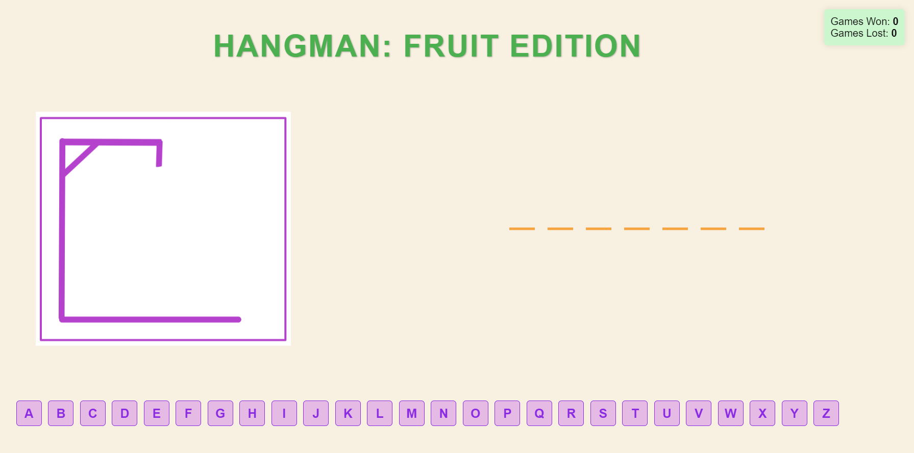
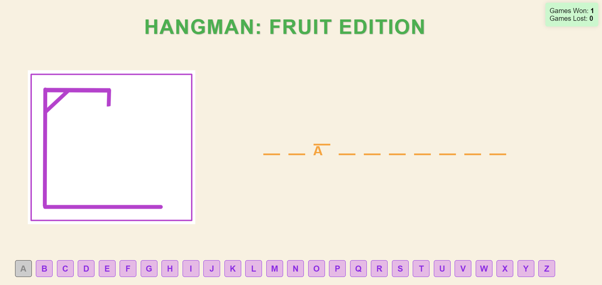
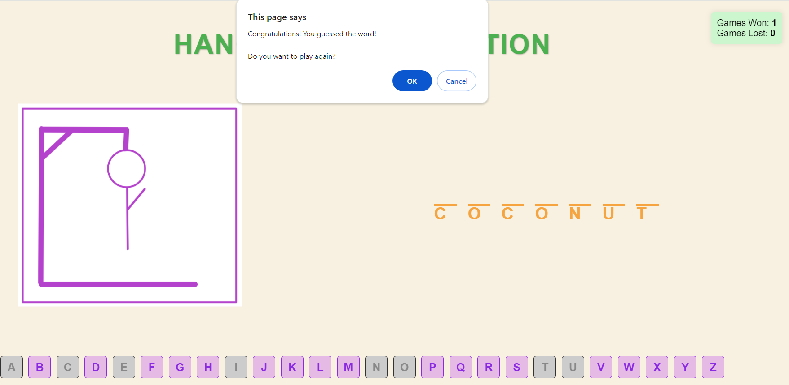
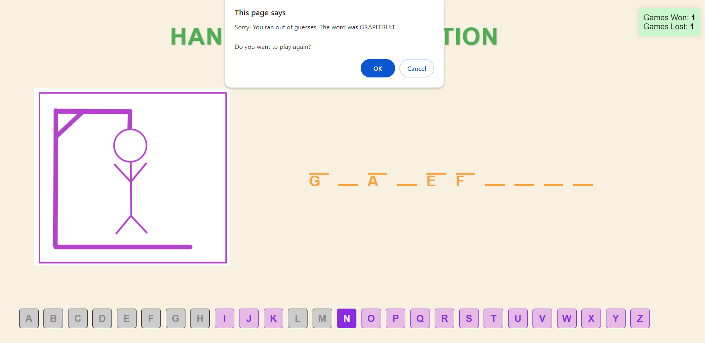

# Dalia Sawaya - 300111681

Hangman game for assignment 2 of CSI3540.

[Système de design](/docs/design_system.md)

# Hangman Game

This is a simple hangman game built with HTML, CSS, and JavaScript. The player guesses letters to reveal a hidden word. After any incorrect guess, a part of the hangman is drawn. The game ends when the player guesses the word correctly or when the hangman is fully drawn (after 6 incorrect guesses).

## How to Play

1. Click on any letter button to make a guess.
2. Guess the letters of the hidden word.
3. For each correct guess, the corresponding letter(s) will be revealed in the word placeholders.
4. For each incorrect guess, a part of the hangman will be drawn.
5. Guess the word before the hangman is fully drawn to win the game.

## Screenshots

- **Initial State**:

- **Incorrect Guess**:

- **Correct Guess**:

- **Game Over - Win**:

- **Game Over - Loss**:

## Scoreboard

- Games Won: 0
- Games Lost: 0

## Play Again?

After winning or losing a game, a confirmation dialog will appear asking if you want to play again. Click "OK" to play again or "Cancel" to exit.

